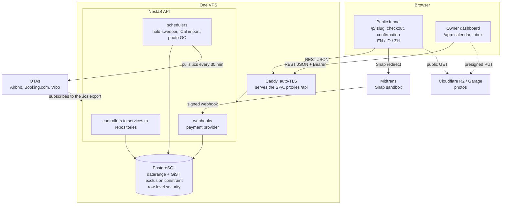

# Sambung

**Direct bookings for Bali accommodation owners, with the OTA calendars kept in sync.**

*Sambung* is Indonesian for *to connect*. A small villa owner pays 15-20% commission on every
OTA reservation, and the moment they take a booking of their own they have to remember to block
those nights on Airbnb, Booking.com and Vrbo by hand. Sambung is the commission-free direct
booking engine plus the lightweight channel manager that stops the double-booking.

It is a portfolio and learning project, built solo. What it is really about is the five hard
problems underneath a deceptively simple product: a booking race, interval arithmetic, an
unreliable third-party sync, an at-least-once payment webhook, and multi-tenant isolation you
can bet someone else's data on.

> **See it run:** [`docs/demo.md`](docs/demo.md) is a five-minute scripted walkthrough.
> Owner adds a property, guest books and pays in the Midtrans sandbox, the nights leave the
> building as an OTA-consumable iCal feed, and a real double-sell gets caught by the database.

---

## Architecture



Note which arrow goes which way at the object store: only the authenticated dashboard **writes**
(the owner's browser PUTs a photo straight to storage with a presigned URL, so the API never
handles the bytes). The public funnel only ever **reads** them.

The one principle everything follows: **the frontend never touches the database.** The SPA is
presentation; the API owns business rules, money, tenancy and every long-running job. `web` may
import `packages/shared` and physically cannot import `packages/db`. Boundaries you can cross by
accident are not boundaries.

Full detail: [`docs/architecture.md`](docs/architecture.md).

---

## Stack

| Layer | Choice | Why this one |
|---|---|---|
| Frontend | Vite + React + TypeScript + Tailwind | Fast, boring, no framework lock-in |
| Routing | TanStack Router | Typed routes and zod-validated search params, which is what a URL-driven booking funnel actually needs |
| Server state | TanStack Query | Server state is a cache, not application state. No Redux |
| Backend | NestJS + TypeScript | Real DI and modules, so the layering is enforced rather than merely encouraged |
| ORM | Drizzle | SQL-first. Composite foreign keys model natively, and the exclusion constraint and RLS policies stay hand-written SQL in the migration, so they cannot drift |
| Database | PostgreSQL 16 | `daterange`, a GiST exclusion constraint, and row-level security. All three are load-bearing, and MySQL has none of them |
| Storage | Garage (dev) / Cloudflare R2 (prod) | S3-compatible on both sides, presigned PUT uploads, zero egress cost |
| Payments | Midtrans Snap, sandbox | Indonesia's dominant gateway, behind a `PaymentGateway` port so no test touches a live provider |
| Email | Resend free tier, else a logging mailer | Behind a `Mailer` port selected by config. Unconfigured renders to the log rather than failing a confirmation |
| i18n | A typed message catalog plus `Intl` | Sixty lines and zero dependencies beats react-i18next's ICU machinery for three languages |
| Monorepo | pnpm workspaces + Turborepo | |
| Deploy | One ~$5/month VPS: Caddy + Docker Compose | Schedulers need an always-on process, and one origin keeps the refresh cookie first-party |

No paid third-party service is required to run any of it.

---

## The five hard parts

Everything else in this repo is CRUD around these.

**1. The double-booking race.** Check-then-insert is a race whatever the isolation level, so the
booking transaction does not decide: it inserts, and a Postgres `EXCLUDE USING gist` constraint
over `(unit_id, daterange(check_in, check_out, '[)'))` arbitrates. Two guests click the same
nights in the same millisecond, one wins, and the loser gets the same `409` the pre-check would
have produced, so a client cannot tell which layer refused. Because an exclusion predicate
cannot call `now()`, lapsed holds are cleared by a sweep at two scopes: an opportunistic one
inside the booking transaction, and a cron as the backstop.
[ADR-0009](docs/adr/0009-a-hold-is-cleared-by-a-sweep-at-two-scopes.md)

**2. Availability is derived, never stored.** There is no `availability` table, and adding one
would be a bug even if every test passed. Free means no `booking` row overlaps you, computed
with the same interval operators the constraint itself uses, so the read cannot disagree with
the write. Dates are half-open `[check_in, check_out)`, which makes a same-day changeover legal
instead of a conflict. [`docs/db-design.md`](docs/db-design.md) §4

**3. An iCal sync that survives a bad feed.** A 30-minute cron pulls every connected calendar
and mirrors it into `booking`. Each `VEVENT` gets its own savepoint, so an event that overlaps a
real booking skips instead of killing the cycle. "Healthy" means a whole, terminated
`BEGIN...END:VCALENDAR`, because a truncated download parses cleanly and looks exactly like an
empty calendar. Cancellations run only against a healthy feed carrying at least one event, so no
network hiccup can mass-cancel real stays. The overlaps that were refused land in an owner inbox
rather than a log file, and a dismissed conflict stays dismissed while a resolved one may
reopen: a measurement can be re-taken, a judgement stands.
[ADR-0025](docs/adr/0025-a-healthy-feed-reconciles-a-doubtful-one-does-nothing.md),
[ADR-0027](docs/adr/0027-dismiss-is-a-judgement-resolve-is-a-measurement.md)

**4. A payment webhook that is safe at least once.** In one transaction: insert
`payment_event(provider, provider_event_id)`, then apply the state change. A unique constraint
arbitrates, so a redelivery and a concurrent duplicate both collapse to a no-op, and a crash
between the two rolls back both for a clean replay. The confirmation page reconciles on *read*
through the identical transition, so a webhook that never arrives still confirms the booking and
the guest's email still fires exactly once.
[ADR-0018](docs/adr/0018-the-payment-webhook-reconciles-on-the-owner-connection.md),
[ADR-0020](docs/adr/0020-reconcile-on-read-pulls-the-event-the-webhook-pushes.md)

**5. Multi-tenant isolation with a second floor under it.** Every tenant-owned query is scoped
by `tenant_id` *and* runs under a Postgres row-level security policy on a non-owner role, so a
forgotten `WHERE` leaks nothing. The tenant principal is owned by one module, and the liveness
guard sits on the session's query funnel rather than on the transaction handle, because
Drizzle's builders are lazy: a query built inside a transaction and awaited after it returns
would otherwise execute on a recycled connection under somebody else's tenant.
[ADR-0026](docs/adr/0026-a-statement-is-guarded-where-it-is-issued.md)

---

## Decisions worth reading

The full log is at the bottom of [`CLAUDE.md`](CLAUDE.md), and each entry links its ADR in
[`docs/adr/`](docs/adr/). These shaped the product rather than the plumbing:

| | Decision |
|---|---|
| [0001](docs/adr/0001-unit-is-one-sellable-thing.md) | A unit is one sellable thing, not a room type with a quantity, because quantity inventory cannot be guarded by an exclusion constraint |
| [0002](docs/adr/0002-deleting-inventory-never-destroys-the-ledger.md) | Deleting inventory never destroys the ledger. Cancelling is a domain event; deleting is amnesia |
| [0004](docs/adr/0004-a-public-url-is-an-address-not-a-view-of-state.md) | A property's public URL is an address, not a view of its state. A rename must not silently kill a link already pasted into an OTA profile |
| [0007](docs/adr/0007-two-surface-design-system.md) | One brand, two surfaces. Hand-designed where guests decide to pay, dependable boring components where owners work |
| [0011](docs/adr/0011-the-owner-is-an-authority-not-a-customer.md) | The owner shares the guest's overlap check, because overlap is physics, but not the guest-protection policy checks, which are the owner's own rules |
| [0012](docs/adr/0012-a-409-carries-a-code-not-a-sentence.md) | A 409 carries a code, not a sentence. Server prose cannot be translated on the client |
| [0013](docs/adr/0013-the-picker-advises-the-server-decides.md) | The picker advises, the server decides. Booked nights are greyed rather than disabled, so there is only ever one definition of "taken" |
| [0022](docs/adr/0022-the-paid-but-lapsed-inbox-marks-not-mutates.md) | The paid-but-lapsed inbox marks, it does not mutate the ledger |
| [0028](docs/adr/0028-property-local-is-a-column-not-an-assumption.md) | Property-local is a column, not an assumption. A UTC-stamped OTA event has no date until you name a time zone |

---

## Repo layout

```
apps/
  web/        Vite + React SPA: public funnel + owner dashboard
  api/        NestJS: REST API, schedulers, webhooks
packages/
  shared/     TS types + zod schemas, the FE/BE contract, imported by both
  db/         Drizzle schema, migrations, seed  (imported ONLY by api)
  config/     eslint / tsconfig / tailwind presets
docs/         PRD, DB design, architecture, API spec, page spec, design system, ADRs
deploy/       Caddyfile
```

---

## Getting started

```bash
git config core.hooksPath .githooks           # one-time: enable the git hooks
pnpm install
docker compose up -d                          # Postgres + Garage (photo storage)
cp packages/db/.env.example packages/db/.env  # dev fixture credentials, committed on purpose
cp apps/api/.env.example apps/api/.env
pnpm --filter @sambung/db db:migrate          # apply migrations, including the RLS policies
pnpm --filter @sambung/db db:setup-role       # create the non-owner role RLS is enforced against
pnpm --filter @sambung/db db:seed             # 2 tenants, 3 properties, demo-ready bookings
pnpm dev                                      # web on :5173, api on :3000
```

Sign in at http://localhost:5173/login as `owner@balibreeze.test` / `sambung123`, or open the
public funnel at http://localhost:5173/p/seminyak-beach-villa. Then follow
[`docs/demo.md`](docs/demo.md).

`pnpm --filter @sambung/db db:reset` drops everything, replays every migration from zero and
re-seeds, in about three seconds. That is also the from-scratch check that the migration history
still builds the schema the code expects.

### Quality gate

```bash
pnpm lint && pnpm typecheck && pnpm test
```

There is no cloud CI, by choice, so these run locally and a `pre-push` hook enforces lint and
typecheck. The DB-backed suites need Docker and run against real Postgres rather than a mock: an
exclusion constraint you have stubbed out is not the thing you were trying to test.

---

## Docs

| Doc | Read it before… |
|---|---|
| [`docs/prd.md`](docs/prd.md) | deciding *what* to build, or whether something is in scope |
| [`docs/db-design.md`](docs/db-design.md) | writing a migration, a query, or anything touching data integrity |
| [`docs/architecture.md`](docs/architecture.md) | wiring FE to BE, adding a module, moving data across the stack |
| [`docs/api-spec.md`](docs/api-spec.md) | adding or changing an endpoint |
| [`docs/page-spec.md`](docs/page-spec.md) | adding or changing a page or route |
| [`docs/design-system.md`](docs/design-system.md) | building or styling any UI |
| [`docs/demo.md`](docs/demo.md) | showing the thing to somebody |
| [`CLAUDE.md`](CLAUDE.md) | changing anything: the invariants, the guardrails, the decision log |

The DB and architecture docs are teaching editions: every decision carries its *why*, because
the point of this project was to get better, not only to ship.

---

## Contributing

Work happens on branches, never on `main` (GitHub Flow):

```bash
git switch -c m5/your-task     # m<milestone>/<short-task>
git push -u origin m5/your-task
gh pr create --base main       # then squash-merge
```

The `pre-push` hook blocks direct pushes to `main` and runs `pnpm lint && pnpm typecheck`.
Enable it once per clone with the `git config core.hooksPath .githooks` above. Run `pnpm test`
yourself before opening a PR, since the DB suites need Docker.
