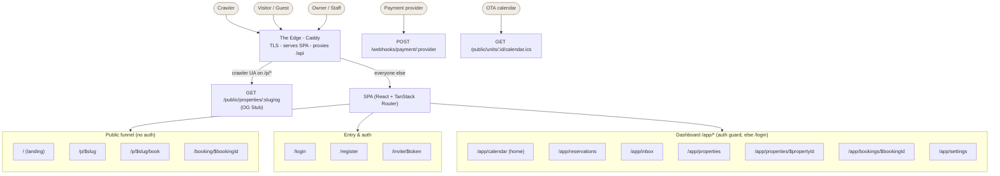

# Sambung - Route Sitemap

> **What this is:** the one place to see *every* route the system exposes - SPA pages and API
> endpoints - what each is for, and how they wire together. The orientation front door.
> **What this is not:** per-page UX detail (that is [`page-spec.md`](./page-spec.md)) or per-endpoint
> shapes/errors (that is [`api-spec.md`](./api-spec.md)). This file **links** into those; it never
> copies them, so there is a single source of truth per fact.
>
> **This file cannot silently go stale.** A test enumerates the *real* routes (the SPA router and the
> Nest controllers) and fails if this map omits or invents one - see [§5](#5-keeping-this-honest-the-guard).
> That is deliberate: the old "site map" in `page-spec.md §1` drifted precisely because nothing enforced it.

**Reading notes**

- **FE routes use `$param`** (TanStack Router: `/p/$slug`); **API routes use `:param`** (Nest: `/public/units/:id/...`). Two layers, two sigils - on purpose.
- API paths are shown **without** the `/api` global prefix (every endpoint is served under `/api/*` behind the Edge).
- **Actor** words are the glossary's ([`CONTEXT.md`](../CONTEXT.md)): Visitor, Guest, Owner, Staff. "authed · scoped" = a Membership, narrowed to assigned Properties by RLS (ADR-0032). "machine" = no human, no page.

---

## 1. Route tree

`/app` itself is the auth shell; its index redirects to `/app/calendar`. `GET /` and `GET /health` are liveness only (omitted above for clarity, listed in [§3](#3-api-routes)).

---

## 2. Frontend routes (SPA)

<!-- fe-routes:start -->

### Public funnel (no auth)

| Route | Purpose | Actor | Detail |
|---|---|---|---|
| `/` | Portfolio landing: what Sambung is, the five hard parts, a live-demo link + owner CTAs. Guests never see it (they open a Property link); its audience is a reviewer or a returning Owner. | Visitor | #60 follow-up |
| `/p/$slug` | Property page: the direct-booking landing reached from an OTA profile or a shared link - gallery, units, availability picker + Quote. | Visitor | page-spec §3.1 |
| `/p/$slug/book` | Checkout: guest details → create the Hold → hand off to payment. | Visitor | page-spec §3.2 |
| `/booking/$bookingId` | Confirmation: live booking status after payment (and the link in the email); reconciles on read. | Guest | page-spec §3.3 |

### Entry & auth

| Route | Purpose | Actor | Detail |
|---|---|---|---|
| `/login` | Sign in; issues the in-memory access token + the refresh cookie. | Visitor | page-spec §3.4 |
| `/register` | Sign up: creates a Tenant + its first Owner. | Visitor | page-spec §3.4 |
| `/invite/$token` | Accept a staff Invite - the token in the path *is* the credential (unauthenticated). | Visitor (invitee) | page-spec §3.4 · ADR-0033 |

### Dashboard `/app/*` (auth guard)

| Route | Purpose | Actor | Detail |
|---|---|---|---|
| `/app` | Auth shell + guard (no session → `/login?next=`). Its index redirects to `/app/calendar`. | Owner · Staff | page-spec §2 |
| `/app/calendar` | The dashboard home: one occupancy Calendar across every Property, coloured by source. | Owner · Staff | page-spec §4.1 · ADR-0010 |
| `/app/reservations` | The operational Reservation list: filter, find, export CSV. | Owner · Staff | page-spec §4.2 |
| `/app/inbox` | Operations inbox: Sync conflicts + paid-but-lapsed Payments - "the system did the safe thing and now needs a human". | Owner · Staff | page-spec §4.6 · ADR-0027 · ADR-0022 |
| `/app/properties` | Inventory home: Property list + create. | Owner · Staff | page-spec §4.4 |
| `/app/properties/$propertyId` | The Property workbench: details, photos, Units, and per-Unit Channels. | Owner · Staff | page-spec §4.5 |
| `/app/bookings/$bookingId` | Booking detail: guest, dates, source, price; cancel. | Owner · Staff | page-spec §4.3 · ADR-0011 |
| `/app/settings` | Tenant settings: the Gallery cap + the Team (invite/roster/assign/revoke). | Owner · Staff | page-spec §4.7 · ADR-0030 · ADR-0033 |

<!-- fe-routes:end -->

> `/app` and its index redirect collapse to one checked route. Owner-only affordances (create/delete/archive a Property, `PATCH /settings`, the Team form) are hidden for Staff in the UI and refused by the server (403); the *pages* are reachable by any member.

---

## 3. API routes

Grouped by module. Machine/edge routes (no page) are last. `api #n` points into [`api-spec.md §2`](./api-spec.md); routes added in M5 (staff, invites, session, archive) predate that index's last refresh and point at their controller/ADR instead.

<!-- api-routes:start -->

### Auth & session - `auth.controller.ts`, `invites.controller.ts`

| Endpoint | Purpose | Auth | Detail |
|---|---|---|---|
| `POST /auth/register` | Sign up: create a Tenant + its first Owner. | public | api #1 |
| `POST /auth/login` | Sign in; returns access token + `memberships[]`, sets the refresh cookie. | public | api #2 · ADR-0034 |
| `POST /auth/refresh` | Silent session restore from the refresh cookie. | public · cookie | api #3 |
| `POST /auth/logout` | End the session. | authed | auth.controller |
| `POST /auth/session` | Switch the active Workspace (Tenant) for a multi-Membership User. | authed | ADR-0034 |
| `GET /auth/me` | The current session. *(No FE consumer - the SPA restores via `refresh`.)* | authed | auth.controller |
| `POST /auth/invites` | Owner invites a Staff member, scoped to chosen Properties. | authed · owner | ADR-0033 |
| `GET /auth/invites` | List pending Invites. | authed · owner | invites.controller |
| `DELETE /auth/invites/:id` | Revoke a pending Invite. | authed · owner | invites.controller |
| `GET /auth/invites/token/:token` | Preview an Invite (public - the token is the credential). | public · token | ADR-0033 |
| `POST /auth/invites/accept` | Accept an Invite → a Staff Membership (creating the User if new). | public · token | ADR-0033 · ADR-0034 |

### Properties - `properties.controller.ts`

| Endpoint | Purpose | Auth | Detail |
|---|---|---|---|
| `GET /properties` | List Properties (Staff see only assigned - RLS). | authed · scoped | api #7 · ADR-0032 |
| `GET /properties/:id` | One Property. | authed · scoped | api #8 |
| `POST /properties` | Create a Property. | authed · owner | api #9 |
| `PATCH /properties/:id` | Edit details (incl. deposit %, time zone, licence). | authed · scoped | api #10 · ADR-0028 |
| `DELETE /properties/:id` | Delete - only if never booked (the ledger guard). | authed · owner | api #11 · ADR-0002 |
| `POST /properties/:id/photos/presign` | A presigned PUT URL for one Gallery upload. | authed · scoped | api #12 |
| `PATCH /properties/:id/photos` | Persist/reorder the Gallery (a whole-set write). | authed · scoped | api #13 |
| `POST /properties/:id/archive` | Retire a Property (public page → 404, slug reserved). | authed · owner | ADR-0005 · ADR-0006 |
| `POST /properties/:id/unarchive` | Restore an archived Property. | authed · owner | ADR-0005 |

### Units - `units.controller.ts`

| Endpoint | Purpose | Auth | Detail |
|---|---|---|---|
| `GET /properties/:propertyId/units` | Units of one Property. | authed · scoped | api #15 |
| `POST /properties/:propertyId/units` | Add a Unit. | authed · scoped | api #14 |
| `GET /units` | Flat Unit list (feeds the Calendar & Reservations). | authed · scoped | ADR-0010 |
| `PATCH /units/:id` | Edit a Unit (price, max guests, min stay). | authed · scoped | api #16 |
| `DELETE /units/:id` | Delete a Unit - only if never booked. | authed · scoped | ADR-0002 |
| `POST /units/:id/archive` | Retire a Unit (drops out of the Unit list). | authed · scoped | ADR-0005 |
| `POST /units/:id/unarchive` | Restore an archived Unit. | authed · scoped | ADR-0005 |

### Bookings (owner) - `bookings.controller.ts`

| Endpoint | Purpose | Auth | Detail |
|---|---|---|---|
| `GET /bookings` | Owner booking rows over a window (full disclosure). | authed · scoped | api #18 · ADR-0010 |
| `GET /bookings/export.csv` | The same rows as CSV (same filter builder). | authed · scoped | api #19 |
| `POST /bookings` | Manual Block / Walk-in - born `confirmed`, no payment. | authed · scoped | api #20 · ADR-0011 |
| `GET /bookings/:id` | Booking detail (owner full disclosure - phone/email). | authed · scoped | api #35 |
| `POST /bookings/:id/cancel` | Cancel - the universal free-the-dates verb (Hold, Walk-in, Block). | authed · scoped | api #21 |

### Public funnel - `public-*.controller.ts`

| Endpoint | Purpose | Auth | Detail |
|---|---|---|---|
| `GET /public/properties/:slug` | Public Property page data. | public | api #22 · ADR-0004 |
| `GET /public/units/:id/availability` | Availability + Quote for a Stay. | public | api #23 · ADR-0008 · ADR-0013 |
| `POST /public/bookings` | Create a Hold - the guest booking write (boss fight #1). | public | api #24 · ADR-0009 |
| `GET /public/bookings/:id` | Confirmation read; reconciles on read (boss fight #4 pull side). | public · unguessable id | api #25 · ADR-0020 |
| `POST /public/bookings/:id/pay` | Open a Midtrans Snap session for the Deposit. | public · unguessable id | api #26 · ADR-0015 |

### Payments (owner inbox) - `payment-inbox.controller.ts`

| Endpoint | Purpose | Auth | Detail |
|---|---|---|---|
| `GET /payments/lapsed` | Paid-but-lapsed Payments needing a human. | authed · scoped | api #36 · ADR-0022 |
| `POST /payments/:id/handle` | Mark a lapsed Payment handled (a marker, never the ledger). | authed · scoped | api #37 · ADR-0022 |

### Channel sync - `channels.controller.ts`, `sync-conflicts.controller.ts`

| Endpoint | Purpose | Auth | Detail |
|---|---|---|---|
| `GET /units/:unitId/channels` | Connections + sync health for a Unit. | authed · scoped | api #29 |
| `POST /units/:unitId/channels` | Connect an OTA iCal feed (smoke-fetched once). | authed · scoped | api #28 · ADR-0016 |
| `DELETE /channels/:id` | Disconnect (keeps imported bookings; reports how many). | authed · scoped | api #30 |
| `POST /channels/:id/sync` | Sync now, one feed. | authed · scoped | api #31 · ADR-0025 |
| `POST /channels/sync` | Sync now, every feed the caller can see. | authed · scoped | api #201 · ADR-0025 |
| `GET /sync-conflicts` | The Sync-conflict inbox list. | authed · scoped | api #32 · ADR-0027 |
| `POST /sync-conflicts/:id/dismiss` | Dismiss a conflict (the Owner's judgement). | authed · scoped | api #33 · ADR-0027 |

### Settings & staff - `settings.controller.ts`, `staff.controller.ts`

| Endpoint | Purpose | Auth | Detail |
|---|---|---|---|
| `GET /settings` | Tenant settings (Gallery cap) - any signed-in member. | authed | api #38 · ADR-0030 |
| `PATCH /settings` | Update settings - Owner only. | authed · owner | api #39 · ADR-0030 |
| `GET /staff` | The Team roster + each member's Assignments. | authed · owner | ADR-0032 |
| `PATCH /staff/:id` | Reassign a Staff member's Properties (whole-set write). | authed · owner | ADR-0032 |
| `DELETE /staff/:id` | Remove a Staff seat (the Membership; the account survives). | authed · owner | ADR-0034 |

### Machine & edge (no page)

| Endpoint | Purpose | Auth | Detail |
|---|---|---|---|
| `GET /` | Liveness hello (scaffold). | machine | app.controller |
| `GET /health` | Health check (liveness probe; no FE consumer). | machine | app.controller |
| `GET /public/units/:id/calendar.ics` | Export feed - confirmed Stays as `.ics` (archive-blind, PII-free by construction). | machine (OTA) | api #34 · ADR-0016 |
| `GET /public/properties/:slug/og` | The OG Stub served to link-preview Crawlers. | machine (crawler) | ADR-0019 |
| `POST /webhooks/payment/:provider` | The Settlement webhook - idempotent reconcile (boss fight #4). | machine (provider) | api #27 · ADR-0018 |

<!-- api-routes:end -->

---

## 4. FE ↔ API traceability

Each page → the endpoints it calls → the feature module behind it → the boss fight / ADR that explains the hard part. Trace one feature end to end here.

| Page | Endpoints it calls | Feature module (`apps/web/src/features/…`) | Hard part |
|---|---|---|---|
| `/` | - (no API calls) | `public-booking/landing-page.tsx` | - |
| `/p/$slug` | `GET /public/properties/:slug` · `GET /public/units/:id/availability` | `public-booking/{property-page, use-availability, availability-picker}` | ADR-0008 · ADR-0013 |
| `/p/$slug/book` | `GET /public/properties/:slug` · `GET …/availability` (re-quote) · `POST /public/bookings` · `POST /public/bookings/:id/pay` | `public-booking/checkout-page.tsx` | boss fight #1 (ADR-0009) · ADR-0015 |
| `/booking/$bookingId` | `GET /public/bookings/:id` | `public-booking/confirmation-page.tsx` | ADR-0020 |
| `/login` | `POST /auth/login` | `auth/login-page.tsx` | - |
| `/register` | `POST /auth/register` | `auth/register-page.tsx` | - |
| `/invite/$token` | `GET /auth/invites/token/:token` · `POST /auth/invites/accept` | `auth/accept-invite-page.tsx` | ADR-0033 · ADR-0034 |
| `/app` (shell) | `POST /auth/refresh` · `POST /auth/logout` · `POST /auth/session` | `dashboard/{app-shell, workspace-switcher}`, `lib/auth` | ADR-0034 |
| `/app/calendar` | `GET /properties` · `GET /units` · `GET /bookings` · `POST /bookings` · `POST /channels/sync` | `calendar/*`, `calendar/manual-booking-dialog` | ADR-0010 · ADR-0011 · ADR-0025 |
| `/app/reservations` | `GET /properties` · `GET /units` · `GET /bookings` · `GET /bookings/export.csv` | `reservations/*` | ADR-0010 |
| `/app/inbox` | `GET /sync-conflicts` · `POST /sync-conflicts/:id/dismiss` · `GET /payments/lapsed` · `POST /payments/:id/handle` | `dashboard/inbox-page`, `channels/*`, `payments/*` | ADR-0027 · ADR-0022 |
| `/app/properties` | `GET /properties` · `POST /properties` | `properties/properties-page.tsx` | ADR-0002 |
| `/app/properties/$propertyId` | `GET/PATCH/DELETE /properties/:id` · `…/photos/presign` · `PATCH …/photos` · `POST …/archive`·`/unarchive` · `GET/POST /properties/:propertyId/units` · `PATCH/DELETE /units/:id` · `POST /units/:id/archive`·`/unarchive` · `GET/POST /units/:unitId/channels` · `DELETE /channels/:id` · `POST /channels/:id/sync` | `properties/{property-edit-page, photos-section, units-section, channels-section}` | ADR-0002 · ADR-0005 · ADR-0016 |
| `/app/bookings/$bookingId` | `GET /bookings/:id` · `POST /bookings/:id/cancel` | `bookings/booking-detail-page.tsx` | ADR-0011 |
| `/app/settings` | `GET/PATCH /settings` · `GET /staff` · `PATCH/DELETE /staff/:id` · `GET/POST/DELETE /auth/invites` | `settings/*`, `staff/team-section.tsx` | ADR-0030 · ADR-0032 · ADR-0033 |

**Routes with no FE page** - their consumer is a machine, or the UI isn't wired:

- `POST /webhooks/payment/:provider` → the payment **Provider** (ADR-0018).
- `GET /public/units/:id/calendar.ics` → a subscribed **OTA** (ADR-0016).
- `GET /public/properties/:slug/og` → a link-preview **Crawler**, routed by the Edge (ADR-0019).
- `GET /` · `GET /health` → liveness probes (no FE consumer; the SPA `/` is now the landing page and calls no API).
- `GET /auth/me` → **no consumer** - the SPA restores a session through `refresh`, which already returns it.

---

## 5. Keeping this honest (the guard)

Two tests enumerate the **real** routes and fail if this file omits or invents one. They read the
sections between the machine markers in [§2](#2-frontend-routes-spa) (`<!-- fe-routes:… -->`) and
[§3](#3-api-routes) (`<!-- api-routes:… -->`) and compare the route in each table's first column
against the source of truth:

| Guard | Source of truth | Lives in |
|---|---|---|
| **FE** | `router.routesById` (the TanStack route tree) | `apps/web/src/sitemap.guard.test.ts` |
| **API** | Nest's `DiscoveryService` over every controller (the same reflection `no-body.spec.ts` uses, #152) | `apps/api/src/sitemap.guard.spec.ts` |

Both run under `pnpm test` (which the pre-push hook and the web build already invoke). Add a route and
forget to document it - or document one that no longer exists - and the guard goes red with the exact
diff. The only deliberate exclusion is TanStack's synthetic `__root__` layout node, which is not a
navigable URL.
